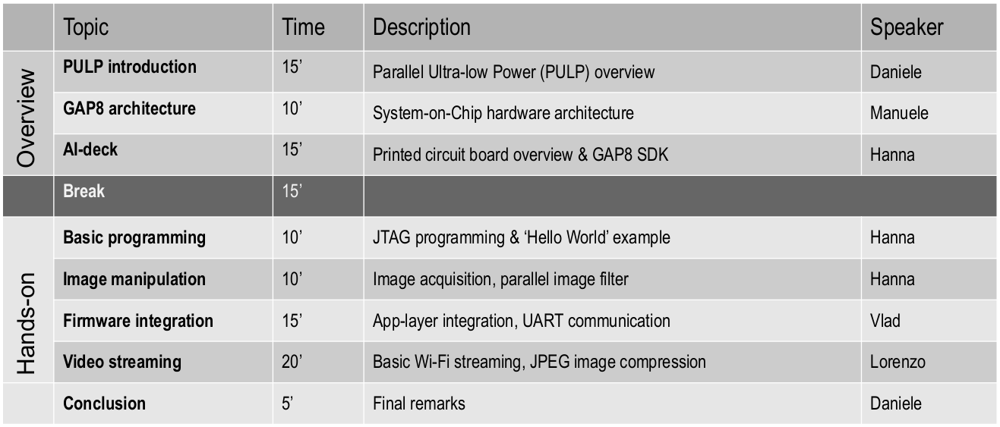

# AI-deck-workshop




## 1. Basic programming

This hands-on shows you how to connect to your AI-deck and how to run your first program on it. It also introduces basic API functions for executing code on multiple cores.
The example will print hello world from all cores. You find more infos about the code in the README inside the helloworld example.


## 2. Image manipulation

This example takes an image, applies a kernel and writes the image over your JTAG cable (using openOCD file semi-hosting) to your computer.
You can choose between two kernels:

- demosaicking 
- inverting

for both you can choose to either execute the kernel sequentially on the fabric controller or parallelized on the cluster.
It is meant to introduce the camera, file transmission via JTAG and parallization of image processing kernels.
You find more infos about the code in the README inside the simple_kernel_example.


## 3. Firmware integration

This example shows how to communicate via UART between the AI-deck and the STM32 in the Crazyflie. The example consists of two parts: the code to be flashed in the GAP8 and the Crazyflie application.
1. The GAP8 code initializes the UART and then sends a counter value every 0.5ms.
2. The Crazyflie application shows how to use UART together with DMA.
Whenever the counter value is received from GAP8, an interrupt is triggered in the STM32, which signals the application to print the counter value in the console.

## 4. Video streaming 

This example streams JPEG images from the AI-Deck to a socket connected via Wi-FI.
The acquisition and JPEG encoding of the acquired image hapens on the GAP8 SoC, while the Wi-Fi transmission is managed by the NINA Wi-Fi module.
The code consists of two pars:
- `wifi_jpeg_streamer/test.c`: the GAP8 C code (camera acquisition of a raw image, jpeg encoding, forward of the jpeg image to NINA)
- `viewer.py`: the Python visualizer receives the images streamed from NINA to the Laptop. By default, it connects to the IP of the AI-deck when use in AccessPoint mode.

Tested on GAP_SDK version 3.8.1.

Commands:
```
Flash GAP8 memory with our code:
make clean all
make image flash io=host

Run code on GAP8 from L2 memory (volatile)
make clean all run io=host

visualize images: python visualizer.py
```


More documentation:

[Bitcraze instructions](https://www.bitcraze.io/documentation/repository/AIdeck_examples/master/test-functions/wifi-streamer/)

[Install GAP sdk](https://greenwaves-technologies.com/setting-up-sdk/)
